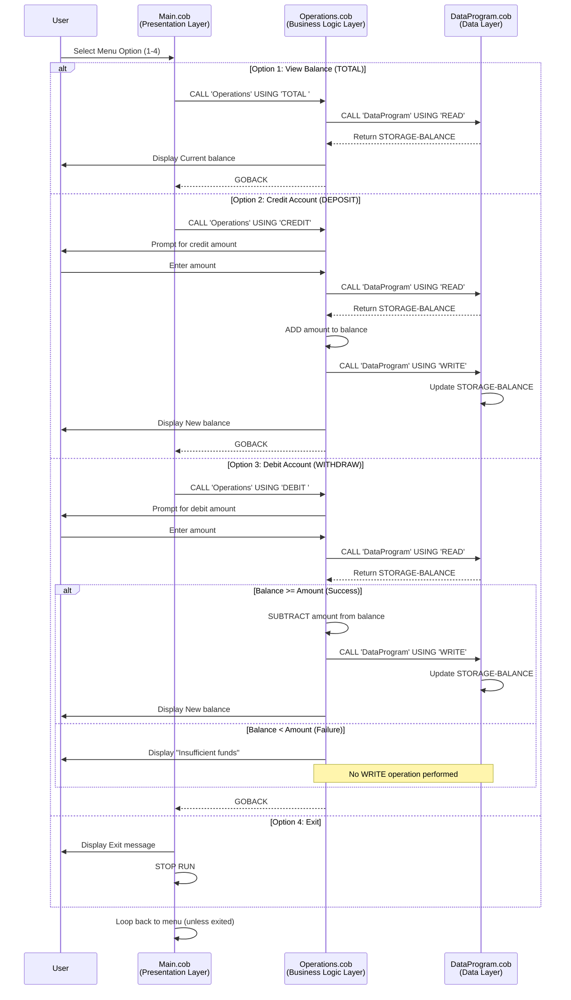

# COBOL Student Account Management System

## Overview

This system is a legacy COBOL-based Account Management application designed to manage student account balances. It provides core functionality for viewing account status, depositing funds (credit operations), and withdrawing funds (debit operations) with built-in safeguards.

## Architecture

The system follows a modular three-tier architecture:
- **Presentation Layer**: User interface and menu system
- **Business Logic Layer**: Account transaction processing
- **Data Layer**: Account balance storage and retrieval

---

## COBOL Modules

### 1. **main.cob** (MainProgram)
**Purpose**: Entry point and user interface for the Account Management System

**Key Functions**:
- Displays an interactive menu with four options
- Accepts and validates user input (choices 1-4)
- Routes user selections to appropriate operations
- Implements a loop-based menu system with an exit mechanism

**Menu Options**:
| Option | Operation | Module Called |
|--------|-----------|---------------|
| 1 | View Balance | Operations (TOTAL) |
| 2 | Credit Account | Operations (CREDIT) |
| 3 | Debit Account | Operations (DEBIT) |
| 4 | Exit Program | Stop Run |

**Key Variables**:
- `USER-CHOICE`: Stores menu selection (PIC 9, range 1-4)
- `CONTINUE-FLAG`: Controls menu loop with YES/NO values

**User Experience**:
- Clean formatted menu with visual separators
- Input validation with error handling for invalid choices
- Graceful exit with confirmation message

---

### 2. **operations.cob** (Operations)
**Purpose**: Business logic layer handling account transactions and operations

**Key Functions**:
- **TOTAL**: Retrieve and display current account balance
- **CREDIT**: Add funds to the account (deposit operation)
- **DEBIT**: Withdraw funds from the account with balance validation

**Operation Details**:

#### TOTAL Operation
- Calls DataProgram with 'READ' operation
- Displays current balance to user
- No side effects on account data

#### CREDIT Operation
- Prompts user for deposit amount
- Reads current balance from DataProgram
- Performs addition of amount to balance
- Writes updated balance back to DataProgram
- Confirms transaction with new balance display

#### DEBIT Operation
- Prompts user for withdrawal amount
- Reads current balance from DataProgram
- **Validates sufficient funds** (key business rule)
  - If balance >= amount: Performs subtraction and writes new balance
  - If balance < amount: Rejects transaction with error message
- Displays result message with updated balance (or error)

**Key Variables**:
- `OPERATION-TYPE`: Identifies which operation to perform
- `AMOUNT`: Stores transaction amount (PIC 9(6)V99)
- `FINAL-BALANCE`: Current account balance maintained during transaction

**Business Rule Implementation**:
- No overdrafts allowed
- Insufficient funds rejection at debit time
- Immediate feedback to user

---

### 3. **data.cob** (DataProgram)
**Purpose**: Data persistence layer managing student account balance storage

**Key Functions**:
- Provides READ/WRITE interface for account balance
- Maintains persistent balance state during program execution
- Acts as a simple data access object (DAO) pattern

**Operations**:

#### READ Operation
- Retrieves current account balance
- Returns STORAGE-BALANCE value to calling program
- Non-destructive operation

#### WRITE Operation
- Updates account balance to new value
- Persists balance for subsequent operations
- Only called after successful transaction validation

**Key Variables**:
- `STORAGE-BALANCE`: Account balance storage (PIC 9(6)V99)
  - Format: 6 digits before decimal, 2 digits after (cents)
  - Example: 1000.00 represents $1,000.00
  - Initial value: 1000.00 (default student account balance)

**Data Characteristics**:
- Account balance persists across multiple operations within a single program run
- Numeric format with fixed decimal (2 places for currency)
- Range: $0.00 to $999,999.99

---

## Business Rules for Student Accounts

### 1. **Initial Account Balance**
- Every student account starts with a balance of **$1,000.00**
- This serves as the initial credit allocation

### 2. **Overdraft Protection**
- Students **cannot overdraw** their accounts
- Any debit request exceeding the current balance is automatically rejected
- System displays error message: "Insufficient funds for this debit."
- Balance remains unchanged on failed debit attempt

### 3. **Credit Operations**
- Students can deposit (credit) unlimited amounts to their account
- No maximum balance limit enforced
- Credit operations always succeed when properly formatted

### 4. **Debit Operations**
- Students can withdraw (debit) up to their current account balance
- Amounts must be positive and properly formatted
- Failed debits do not affect account balance

### 5. **Transaction Processing**
- All transactions are immediate (synchronous)
- Read-before-write pattern ensures data consistency
- Each operation completes before returning to menu

### 6. **Account Visibility**
- Students can view their current balance at any time
- Balance inquiries do not affect the account

---

## Data Flow Diagram

```
User Input (main.cob)
        |
        v
Menu Selection (1-4)
        |
        v
Operations Module Branch
    |       |        |
    v       v        v
  TOTAL  CREDIT    DEBIT
    |      |         |
    +------+----+----+
              |
              v
        DataProgram
              |
        +-----------+
        |           |
        v           v
      READ        WRITE
        |           |
        v           v
  Retrieve    Update
   Balance    Balance
```

---

## Implementation Notes

### Module Interdependencies
- **main.cob** → **operations.cob** : User selections trigger operations
- **operations.cob** → **data.cob** : All balance modifications flow through data layer

### Error Handling
- Invalid menu choices: Caught and user is prompted to re-select
- Insufficient funds: Caught at operations layer before write operation
- Input validation: Performed at point of user input

### Numeric Precision
- All balances use COBOL NUMERIC with 2 decimal places
- Ensures accurate currency representation

---

## Development Notes

**Legacy System Characteristics**:
- Written in COBOL-85/COBOL-2002
- Uses traditional PERFORM loops and EVALUATE statements
- Implements inter-program communication via CALL and USING clauses
- Manual balance management without database integration

**Potential Modernization Considerations**:
- Migration to database for persistence
- Enhanced UI framework
- Additional account holder authentication
- Audit trail and transaction history
- API-based access layer

---

## Sequence Diagram: Data Flow



### Diagram Legend
- **Blue arrows (→)**: Synchronous calls with parameters
- **Dashed arrows (-- >>)**: Return values or responses
- **Alt blocks**: Conditional branching based on user selection or validation
- **Note blocks**: Important business logic (e.g., no write if insufficient funds)
